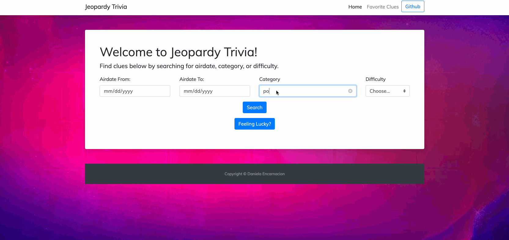

# Capital One - Summit Challenge 2019:

Link: http://c1-jeopardy.herokuapp.com/

IMPORTANT: On the category search, here are some categories to search by to get you started! 
odd jobs, movies, politics, time, trivia, cars and etc.

A interactive trivia based on Jeopardy clues, utilizing the JServiceIO API. 

## Summary: 

Prior to getting started with this web app, I have absolutely no knowledge of fullstack web development, web frameworks like Flask, CSS3, HTML5, API calls...basically, I've never done anything like this. My only experience has been some Python data science work and Java class projects.

*Throughout this project I learned:*

1. How to access an API using POSTMAN and Python calls
2. How to create a frontend using HTML5, CSS3, and JS and connect it to backend operations using Flask and Jinja templating 
3. Jquery ajax functions to retrieve API data
4. Learned about JSON document response
5. Localstorage in browser to save preferences
6. Loop through a list in JS
7. Manipulate JSON data to retrieve key/value pairs I needed to serve data to the frontend

This was absolutely amazing for me because only knowing basic Python and Java forced me to also learn how to read through documentation, source debugging help from Stackoverflow and other online resources, and ask for help when I got stuck. 

JSON is also new territory for me as well as parsing through JSON dictionaries using Python. I became more familiar with manipulating data and empty values when I learned how to create a card in Bootstrap and use a Jinja for-loop to dynamically create cards as JSON data came in from Python. 

My favorite part of this entire project was learning how to write Javascript functions and use jquery libraries to create an autocomplete search box! I was able to go from never having written anything in javascript or jquery to create a functioning search box for categories. 

## Challenge: 
Utilizing unfamiliar technologies, I had to become acquainted with various new concepts, languages, and frameworks while building the functionality for a front and back-end web application. 

## Tech/Frameworks Used: 
Bootstrap
HTML5, CSS, Jquery/Javascript 
POSTMAN,
Python
Flask w/ Jinja Templating

## Future Updates:
- Connect localStorage function I built to a favorite web page (disabled hyperlink, currently) to save your favorite clues to a list
- Create a trivia game called BEAST MODE JEOPARDY to give you varying difficulty level cards to guess the answer before time runs out
- Learn how to convert Flask app to VueJS for more functionality 
-Known bug: pagination not fully implemented (not a requirement as per project criteria)

## Conclusion: 
This experience has given me the confidence that I am capable of building a web application even I haven't been exposed to technologies that were required in order for this to be possible. I am so excited and proud of the work Capital One has pushed me to do because these are not the types of projects your are introduced to in universities.

I am looking forward to continue self-learning and become a better developr as well as to build on this project. Thank you for the opportunity, Capital One.

